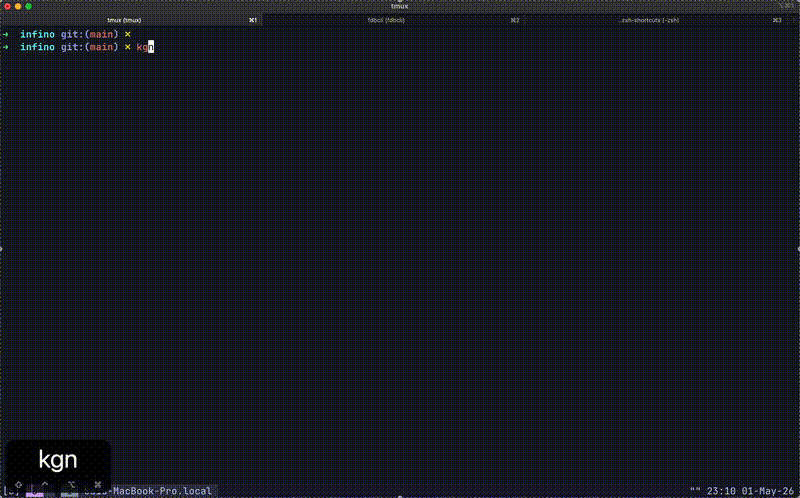

# kubectl-zsh-shortcuts

Zsh shortcuts for day-to-day Kubernetes work, with kubectl-native autocomplete wired to every alias.

## Quick Start

```bash
# type shortcut + TAB for live suggestions
kgp <TAB>                 # pod names / next args
kl <TAB>                  # pod names for logs
kdp <TAB>                 # pod names for describe
kgpn kube-system <TAB>    # pods in kube-system
```

## Demo



## What it includes

- Fast aliases for `get`, `describe`, `logs`, `exec`, `scale`, `delete`, `apply`, and namespace/context commands
- Autocomplete for all aliases through `_k8s_aliases` -> `_kubectl`
- Completion caching and menu selection for quicker interactive use

## Requirements

- `zsh`
- `kubectl` available in `PATH`

## Install

```bash
git clone <your-repo-url> kubectl-zsh-shortcuts
cd kubectl-zsh-shortcuts
chmod +x install.sh
./install.sh
```

Then restart your shell or run:

```bash
source ~/.zshrc
```

## Usage

```bash
kgp
kgpn kube-system
kl <pod-name>
kdp <pod-name>
kex <pod-name> -- sh
```

## Manual install

```bash
mkdir -p ~/.zsh
cp kubectl-shortcuts.zsh ~/.zsh/kubectl-shortcuts.zsh
mkdir -p ~/.zsh/completions
cp completions/_k8s_aliases ~/.zsh/completions/_k8s_aliases
echo 'source ~/.zsh/kubectl-shortcuts.zsh' >> ~/.zshrc
source ~/.zshrc
```

## Uninstall

```bash
rm -f ~/.zsh/kubectl-shortcuts.zsh
rm -f ~/.zsh/completions/_k8s_aliases
```

Remove this line from `~/.zshrc`:

```bash
source ~/.zsh/kubectl-shortcuts.zsh
```

## Notes

- `watch` aliases (`kwp`, `kwd`, `kwss`) require the `watch` command.
- `kubectl top` aliases require Metrics Server in your cluster.
- Pod/namespace suggestions come from `kubectl completion zsh` (`_kubectl`).
- `_k8s_aliases` is a thin wrapper that keeps alias-specific help text and forwards completion to `_kubectl`.
